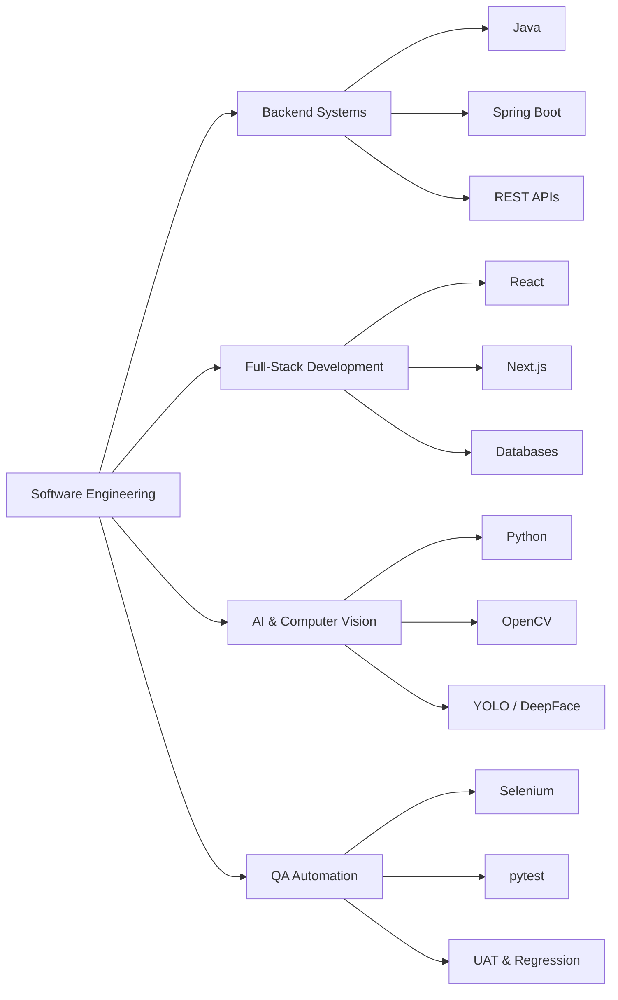

<div align="center">

# 👋 Hi, I'm Md Jahid Hasan

### Full-Stack Developer · Java · Python · AI & Computer Vision

**Building scalable software systems — from backend architecture to intelligent computer vision applications.**

<br/>

[](https://md-jahid-hasan.vercel.app/view/index.html)
[](https://github.com/Jahid1217)

</div>

---

## 👨‍💻 About Me

I'm a software developer from **Dhaka, Bangladesh**, passionate about building practical, scalable, and real-world software solutions.

My work spans **backend development, full-stack applications, software quality assurance, automation, artificial intelligence, and computer vision**.

> **Dedicated and results-driven Software Engineer focused on building reliable, maintainable, and intelligent software systems.**

* 🔭 Building **scalable backend systems with Java & Spring Boot**
* 💻 Developing **full-stack web and enterprise applications**
* 🤖 Exploring **Artificial Intelligence, Machine Learning & Computer Vision**
* 🧪 Working with **Software QA, Automation Testing & Selenium**
* 🎯 Focused on **clean architecture, maintainable code & scalable systems**
* 🌱 Learning **distributed systems, microservices & AI integration**
* ⚙️ Interested in **automation and solving repetitive problems with code**
* 🌐 Portfolio: **[jahid1217.github.io/resume](https://jahid1217.github.io/resume/view/index.html)**

---

# 🧰 Tech Stack

## 💻 Programming Languages

<p align="left">


</p>

## ⚙️ Backend & Frameworks

<p align="left">


</p>

## 🎨 Frontend & Mobile

<p align="left">


</p>

## 🤖 AI, ML & Computer Vision

<p align="left">


</p>

## 🗄️ Databases & Infrastructure

<p align="left">


</p>

## 🧪 Testing & Automation

<p align="left">


</p>

## 🛠️ Tools & Platforms

<p align="left">


</p>

---

# 📌 Featured Projects

| Project | Description | Tech Stack |
| :--- | :--- | :--- |
| 🏢 **[Home Harmony](https://github.com/Jahid1217/home-harmony)** | Full-stack apartment & building management system for the Bangladeshi market. Features multi-building architecture, tenant verification (DMP police format), role-based access control, and local payment gateway integration (bKash/Nagad). Comprehensive technical documentation included. | Spring Boot · Next.js · PostgreSQL · Docker |
| 🤖 **[Face Match](https://github.com/Jahid1217/Face_Match)** | AI-powered face matching and facial recognition system | Python · OpenCV · DeepFace |
| 🎯 **[GoalFlow](https://github.com/Jahid1217/Mobile_Appreciate-__Target-)** | Modern Android goal-tracking application with local data storage | Kotlin · Jetpack Compose · Room |
| 📹 **[CCTV Attendance System](https://github.com/Jahid1217/attendance_system_Using_cctv)** | Automated smart attendance tracking using real-time computer vision | Python · OpenCV |
| 🧪 **[Selenium Test Suite](https://github.com/Jahid1217/Selenium-automaton-testing-)** | Automated beneficiary validation workflows for social safety-net systems | Python · Selenium · pytest |
| 🚆 **[Railway Application](https://github.com/Jahid1217/Railway-Applications)** | Railway booking and management system with end-to-end workflows | C# |
| 🏢 **[Hostel Management System](https://github.com/Jahid1217/Hostel-management-system-Java)** | Hostel operations and management application | Java |
| 🚗 **[Car Rental Website](https://github.com/Jahid1217/Car-Rental-Website)** | Web-based vehicle rental and booking platform | PHP · MySQL |

<div align="center">

### 🔎 Explore More Projects

[](https://github.com/Jahid1217?tab=repositories)

</div>

---

# 💼 Experience

## 🏢 Full-Stack Developer

**Personal & Freelance Projects · 2023 – Present**

* Architected and developed **Home Harmony**, a comprehensive apartment management system targeting the Bangladeshi market
  * Designed multi-building infrastructure with tenant verification workflows based on DMP police formats
  * Implemented role-based access control (RBAC) for Admin, Building Manager, and Tenant roles
  * Integrated local payment gateways (bKash, Nagad) for utility payments and maintenance fees
  * Built responsive frontend with Next.js and backend REST APIs with Spring Boot
  * Containerized application using Docker for scalable deployment
  * Produced detailed technical documentation for stakeholders and developers
* Developed full-stack applications using **PHP, ASP.NET MVC, ASP.NET Web API, NestJS, MySQL, and SQL Server**
* Built a complete **Car Rental Management System** with customer, driver, and admin panels
  * Implemented booking management, payment processing, invoice generation, and reporting
* Developed a **Healthcare Management System** with role-based access for Admin, Doctor, and Patient
  * Implemented OTP registration, email verification, appointment management, and prescription tracking
* Designed and developed **RESTful APIs** for database-driven applications
* Implemented authentication, authorization, file uploads, validation, and dashboard reporting
* Used **Git and GitHub** for source control, branching, and development workflows

## 🧪 Junior Software QA Engineer

**Karooth IT Bangladesh · 2025 – Present**

* Perform manual and automated testing for government and enterprise applications
* Work with **SNSOP MIS, GRM Mobile Application, and IT Helpdesk systems**
* Design and execute functional, regression, integration, and UAT test cases
* Report defects and perform verification after fixes
* Conduct production-release validation and smoke testing
* Automate repetitive UI testing workflows using Selenium and pytest
* Prepare comprehensive test reports, issue summaries, and release validation documentation
* Collaborate with developers and stakeholders to identify defects and improve software quality

## 🎓 Academic & Technical Projects

* Implemented **pothole detection and area calculation using YOLOv5**
* Applied computer vision and image-processing techniques using **Google Colab**
* Performed healthcare data analysis and visualization using **R and ggplot2**
* Developed responsive web applications using **HTML, CSS, JavaScript, and Bootstrap**

---

# 🎓 Education

### Bachelor of Science in Computer Science & Engineering

**American International University-Bangladesh (AIUB)**
Dhaka, Bangladesh
📅 **2021 – 2025**

---

# 📊 GitHub Analytics

<div align="center">

### 📈 Overall GitHub Statistics


<br/>

### 🔥 Contribution Streak


<br/>

### 📉 Contribution Activity Graph


<br/>

### 📊 GitHub Profile Summary


<br/>


<br/>

### ⏰ Productive Time


</div>

---

# 🏆 GitHub Trophies

<div align="center">


</div>

---

# 📌 Developer Focus

```text
Backend Development        ███████████████████░   Java · Spring Boot
Full-Stack Development     ██████████████████░░   React · Next.js · PHP · ASP.NET
QA & Test Automation       █████████████████░░░   Selenium · pytest
AI / Computer Vision       ███████████████░░░░░   Python · OpenCV · YOLO
Mobile Development         ████████████░░░░░░░░   Kotlin · Jetpack Compose
DevOps / Infrastructure    ██████████░░░░░░░░░░   Docker · PostgreSQL · Linux · Git
```

---

# 🎯 Current Focus



---

# 🧠 Development Interests

<table width="100%" align="center">
  <tr>
    <th width="33%" align="center">⚙️ Backend Engineering</th>
    <th width="34%" align="center">🤖 Artificial Intelligence</th>
    <th width="33%" align="center">🧪 Quality Engineering</th>
  </tr>
  <tr>
    <td align="center">☕ Java</td>
    <td align="center">🤖 Machine Learning</td>
    <td align="center">🧪 Automation Testing</td>
  </tr>
  <tr>
    <td align="center">🍃 Spring Boot</td>
    <td align="center">👁️ Computer Vision</td>
    <td align="center">🌐 Selenium</td>
  </tr>
  <tr>
    <td align="center">🔗 REST APIs</td>
    <td align="center">🐍 Python</td>
    <td align="center">✅ UAT</td>
  </tr>
  <tr>
    <td align="center">🗄️ Database Design</td>
    <td align="center">🎯 YOLO</td>
    <td align="center">🔄 Regression Testing</td>
  </tr>
  <tr>
    <td align="center">🐳 Docker</td>
    <td align="center">🧠 Deep Learning</td>
    <td align="center">📋 Test Documentation</td>
  </tr>
</table>

---

# ⚡ Random Developer Quote

<div align="center">


</div>

---

# 🤝 Let's Connect

I'm always interested in discussing:

* 💻 Software Engineering & Architecture
* ☕ Java & Spring Boot
* 🌐 Full-Stack Development (React, Next.js, Node.js)
* 🏢 Enterprise Applications & Scalability
* 🤖 Artificial Intelligence & Machine Learning
* 👁️ Computer Vision
* 🧪 Software QA, Automation & UAT
* 🌍 Open-source Collaboration
* 🚀 Interesting Software Projects

<div align="center">

[](https://md-jahid-hasan.vercel.app/view/index.html)
[](https://github.com/Jahid1217)

</div>

---

<div align="center">

### 💡 Always learning, always building.

⭐ **If you find my projects useful, consider giving them a star!**

</div>
